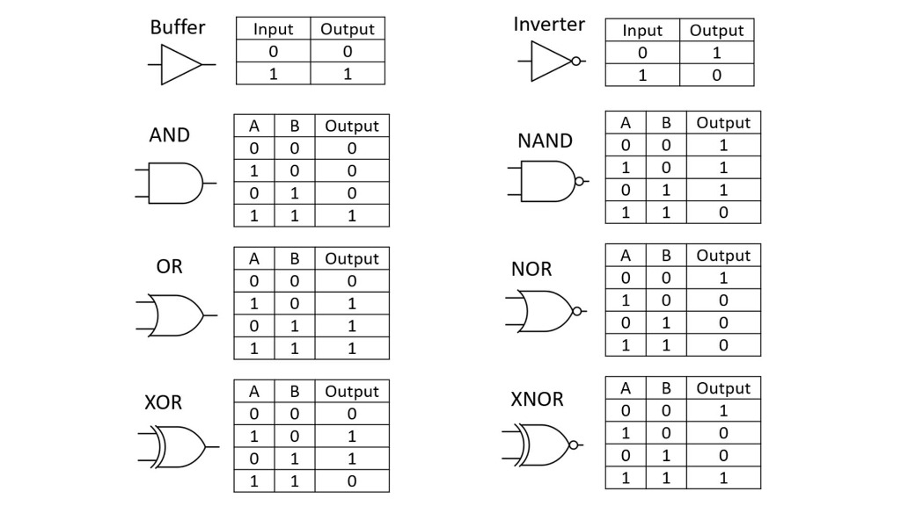
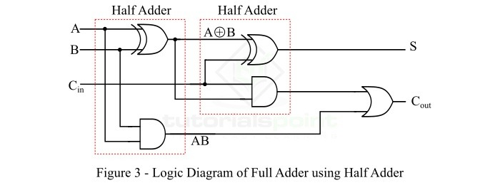

# AR101: Computer Architecture and Organization
## Complete Chronological Reviewer & Exam Digest (Weeks 2 to 7)
**Student:** Luigi Emanuel Britania • **Year & Section:** 3rd Year - SBIT3G  
**Institution:** Quezon City University — College of Computer Studies — Information Technology Department  
**Academic Year:** 2026–2027 (1st Semester)

---

## 📌 TABLE OF CONTENTS
1. [Week 2: Introduction to Computer Architecture and Organization](#week-2-introduction-to-computer-architecture-and-organization)
2. [Week 3: Main Memory and Central Processing Unit (CPU)](#week-3-main-memory-and-central-processing-unit-cpu)
3. [Week 4: Intel Microprocessors, Logical and Physical Memory](#week-4-intel-microprocessors-logical-and-physical-memory)
4. [Week 5: Understanding Memory Segments, Stack Operations and Addressing Modes](#week-5-understanding-memory-segments-stack-operations-and-addressing-modes)
5. [Week 6: Data Transfer Instructions & Tracing](#week-6-data-transfer-instructions--tracing)
6. [Week 7: The Arithmetic Unit (Part 1)](#week-7-the-arithmetic-unit-part-1)

---

## WEEK 2: INTRODUCTION TO COMPUTER ARCHITECTURE AND ORGANIZATION

### 1. Fundamental Definition of a Digital Computer
- **Digital Computer**: A fast electronic calculating machine that:
  1. Accepts **digitized input information**.
  2. Processes it according to a list of internally stored instructions (**program**).
  3. Produces resulting **output information**.

### 2. Classification / Types of Computers
1. **Personal Computers (PCs)**: Everyday computing for individual users (desktops, laptops).
2. **Workstations**: High-performance single-user systems engineered for heavy technical, mathematical, graphic, or engineering workloads.
3. **Mainframes**: Enterprise-grade systems built for high-throughput batch processing, massive transaction volumes, and mission-critical reliability.
4. **Supercomputers**: Ultra-high-performance computational clusters optimized for massive parallel calculations, weather modeling, scientific simulations, and cryptography.

### 3. The 5 Functional Units of a Computer
A computer comprises five functionally independent main parts:
```
┌────────────────────────────────────────────────────────┐
│                      PROCESSOR                         │
│  ┌───────────────────────┐   ┌──────────────────────┐  │
│  │ ARITHMETIC & LOGIC    │   │ CONTROL UNIT (CU)    │  │
│  │ UNIT (ALU)            │   │ (Directs activities) │  │
│  └───────────▲───────────┘   └──────────▲───────────┘  │
└──────────────┼──────────────────────────┼──────────────┘
               ▼                          ▼
       ┌───────────────┐          ┌───────────────┐
       │     MEMORY    │          │  INPUT /      │
       │  (RAM / ROM)  │          │  OUTPUT (I/O) │
       └───────────────┘          └───────────────┘
```
1. **Input Unit**:
   - Accepts coded information from human operators or other computer systems.
   - Examples: Keyboard, mouse, joystick, input pen, touch screen, trackball, optical scanner, barcode readers, microphone, magnetic disks, floppy disks, CD/compact discs.
2. **Memory Unit / Primary Storage**:
   - Where programs and active data are held during execution.
   - Operates at electronic speeds.
   - Information is stored in fixed-size groups called **WORDS**.
   - Each word has a distinct numerical **Address** (e.g., location 0, 1, 2, ... 4,194,303).
   - **4 Main Memory Divisions**:
     - *Input Storage Area*: Holds raw input data arriving from input devices.
     - *Working Storage Space*: Holds intermediate calculation results.
     - *Output Storage Area*: Holds processed data prepared for transfer to output devices.
     - *Program Storage Area*: Holds the actual program instructions currently being executed.
3. **Secondary / Auxiliary Storage**:
   - Used when large volumes of data must be stored on a permanent basis, particularly data accessed less frequently (e.g., hard drives, magnetic tapes, optical disks).
4. **Central Processing Unit (CPU) / Processor**:
   - Operates roughly **10 times faster** than main memory.
   - Divided into:
     - **ALU (Arithmetic and Logic Unit)**: Performs arithmetic operations (addition, subtraction, multiplication) and logical decisions (AND, OR, NOT, XOR).
     - **Control Unit (CU)**: Coordinates all computer operations. It fetches instructions, decodes them, and issues control signals to memory, ALU, and I/O devices.
5. **Output Unit**:
   - Sends processed results to the outside world.
   - Examples: Display monitors/screens, printers, plotters, modems, micro-films, voice synthesizers, high-tech blackboards, film records.

### 4. Basic Operational Steps of a Computer
1. The computer **accepts information** via the input unit.
2. Information stored in memory is **fetched under program control** into the ALU, where it is actively processed.
3. Processed information leaves the computer through the **output unit**.
4. **All activities** inside the machine are directed and supervised by the **Control Unit (CU)**.

### 5. Computer Architecture vs Computer Organization
- **Computer Architecture**: The conceptual design and fundamental operational structure of a computer system, including its **Instruction Set Architecture (ISA)**, data formats, register models, and addressing modes visible to the programmer.
- **Von-Neumann Architecture**: Also known as **Stored Program Architecture** or **Fetch-Decode-Execute Architecture**.
  - Programs and data share the same unified memory space.
  - Instructions are executed sequentially unless an explicit jump/branch occurs.
- **Computer Organization**: The operational units and their interconnections that realize the architectural specifications (e.g., hardware signals, bus widths, clock frequencies, memory technology).

### 6. Programming Languages: Low-Level vs High-Level
- **Hierarchy of Programming Languages**:
  1. *Machine Language*: Binary 1s and 0s directly understood by hardware.
  2. *Assembly Language*: Low-level symbolic mnemonics (`MOV`, `ADD`, `SUB`) mapped 1-to-1 to machine codes; requires an Assembler.
  3. *High-Level Language*: Human-readable, abstracted languages (C, C++, Java, Python, C#); requires a Compiler or Interpreter.
  4. *4GL (Fourth-Generation Language)*: Non-procedural, declarative languages closer to human natural language (SQL, database query languages).
- **Advantages of High-Level Languages over Low-Level**:
  - **Easy to Learn**: Natural syntax and structured constructs.
  - **Predefined Functions**: Massive built-in standard libraries.
  - **Portability**: Code can run on different processor architectures with minimal or no changes after recompilation.
- **Advantages of Low-Level Languages over High-Level**:
  - **Compact Code**: Generates smaller binary footprints without runtime overhead.
  - **Speed**: Executes significantly faster due to direct hardware control.
  - **Flexible**: Provides direct, granular manipulation of hardware registers, memory addresses, and CPU flags.

---

## WEEK 3: MAIN MEMORY AND CENTRAL PROCESSING UNIT (CPU)

### 1. Processor-Memory Interconnection & Internal Registers
```
┌─────────────────────────────────────────────────────────────┐
│                      PROCESSOR (CPU)                        │
│                                                             │
│   ┌────────┐        ┌────────┐       ┌──────────────────┐   │
│   │  MAR   │◄───────┤   PC   │       │  CONTROL UNIT    │   │
│   └────┬───┘        └────────┘       └────────┬─────────┘   │
│        │                                      │             │
│        │            ┌────────┐       ┌────────▼─────────┐   │
│        │            │   IR   │◄──────┤       ALU        │   │
│        │            └────────┘       └────────▲─────────┘   │
│   ┌────▼───┐                                  │             │
│   │  MDR   │◄─────────────────────────────────┘             │
│   └────▲───┘                                                │
│        │         ┌──────────────────────────────────────┐   │
│        │         │ General Purpose Registers: R0 to R(n)│   │
│        │         └──────────────────────────────────────┘   │
└────────┼────────────────────────────────────────────────────┘
         ▼ (Address / Data / Control Lines)
┌─────────────────────────────────────────────────────────────┐
│                        MAIN MEMORY                          │
└─────────────────────────────────────────────────────────────┘
```
- **PC (Program Counter)**: Contains the memory address of the next instruction to be fetched and executed. Automatically incremented after fetching.
- **MAR (Memory Address Register)**: Holds the address of the memory location currently being read from or written to.
- **MDR (Memory Data Register)**: Holds the data word read from memory or waiting to be written into memory.
- **IR (Instruction Register)**: Holds the instruction word currently being decoded and executed by the Control Unit.
- **General Purpose Registers (R_0, R_1, dots, R_n-1)**: Fast temporary storage within the CPU for holding operands and intermediate calculation results.

### 2. CPU Read and Write Operations
- **Fetch / Read Operation (Memory → CPU)**:
  1. CPU sends the target memory address to the **MAR**.
  2. CPU issues a **READ** control signal on the control bus.
  3. The addressed word is retrieved from Main Memory and loaded into the **MDR**.
  4. The word in Main Memory remains **unchanged (non-destructive read)**.
- **Store / Write Operation (CPU → Memory)**:
  1. CPU sends the target memory address to the **MAR**.
  2. CPU places the data to be written into the **MDR**.
  3. CPU issues a **WRITE** control signal.
  4. The data from MDR is written into the memory location, **destroying / overwriting** whatever was previously stored there.

### 3. Step-by-Step Instruction Execution Trace: `ADD LOCA, R0`
Suppose the instruction `ADD LOCA, R0` is stored at memory location `INSTR`, and `PC` initially holds `INSTR`:
1. **MAR ← [PC]**: Address of instruction loaded into MAR.
2. **READ Signal issued**: Main memory reads location; **MDR ← [Memory]**, and **PC ← [PC] + 1** (increment PC to point to next instruction).
3. **IR ← [MDR]**: Instruction transferred to Instruction Register for decoding.
4. **MAR ← [LOCA]**: Address of operand `LOCA` (extracted from IR addressing field) loaded into MAR.
5. **READ Signal issued**: Main memory reads location `LOCA`; **MDR ← [Memory]**.
6. **R_0 ← [R_0] + [MDR]**: ALU adds the contents of register R_0 with MDR and stores the sum back into R_0.

### 4. The 7 Universal CPU Operating Steps
1. Fetching the instruction.
2. Incrementing the PC.
3. Decoding the instruction.
4. Determining the location of data in memory (if required).
5. Fetching the required data into an internal CPU register.
6. Executing the instruction.
7. Return to step 1 (repeat cycle).

### 5. Instruction Formats and Address Notations
An instruction generally consists of two primary fields:
- **Operation Field (Opcode)**: Specifies what operation to perform (e.g., 8 bits → up to 256 unique instructions).
- **Addressing Information**: Specifies the operand addresses (e.g., 24 bits).

#### Address Notations Comparison:
| Type | Example | Internal Action | Notes |
| :--- | :--- | :--- | :--- |
| **0-Address** | `INC`, `DEC` | `ACC <- [ACC] + 1` | Operands defined implicitly (Stack or Accumulator). |
| **1-Address** | `LOAD A`<br>`ADD B`<br>`STORE C` | `ACC <- [A]`<br>`ACC <- [B] + [ACC]`<br>`[C] <- [ACC]` | Implicitly uses the **Accumulator (ACC)** register for all operations. |
| **2-Address** | `ADD A, B` | `A <- [A] + [B]` | Destination `A` is also one of the source operands. Overwrites `A`. |
| **3-Address** | `ADD A, B, C` | `A <- [B] + [C]` | `B` and `C` are pure source operands; `A` is pure destination operand. Preserves sources! |

### 6. Straight-Line Sequencing vs Branching
- **Straight-Line Sequencing**: Instructions stored in sequential memory addresses (i, i+1, i+2) are executed one after another in numerical order.
- **Branching (Loops & Decisions)**:
  - Alter the normal sequential flow by loading a new target address into the **PC** when a condition is met (e.g., `Branch > 0 LOOPSTART`).

### 7. Bus Structures
- **Bus**: A collection of physical wires transmitting signals between computer components.
- **3 Main Groups of Bus Lines**:
  1. **Data Bus**: Carries bidirectional data between CPU, memory, and I/O.
  2. **Address Bus**: Unidirectional lines carrying the memory or I/O address generated by the CPU.
  3. **Control Bus**: Carries timing, status, and control signals (READ, WRITE, READY, INTERRUPT).
- **Single-Bus vs Two-Bus Structure**:
  - *Single-Bus Structure*: All units (CPU, Memory, I/O) share one common bus. Simpler and cheaper, but introduces a major throughput bottleneck (only one transfer can occur at a time).
  - *Two-Bus Structure*:
    - **Configuration 1**: Memory Bus connects CPU ↔ Memory; I/O Bus connects CPU ↔ I/O devices.
    - **Configuration 2**: Memory Bus connects CPU ↔ Memory and Memory ↔ I/O; I/O Bus connects I/O devices.

---

## WEEK 4: INTEL MICROPROCESSORS, LOGICAL AND PHYSICAL MEMORY

### 1. Chronological Evolution of Intel Microprocessors
| Year | Processor | Bus Width | Memory Addressing Capacity | Notable Features |
| :---: | :---: | :---: | :---: | :--- |
| **1971** | **Intel 4004** | 4-bit | 4,096 4-bit locations (2,048 bytes / 2 KB) | World's first commercial single-chip microprocessor. |
| **1972** | **Intel 8008** | 8-bit | 16,384 bytes (16 KB) | 48 instructions, built for computer terminals. |
| **1973** | **Intel 8080** | 8-bit | 64 KB | Faster, 10x performance of 8008, used in Altair 8800. |
| **1978** | **Intel 8085** | 8-bit | 64 KB | Single +5V supply, integrated clock oscillator. |
| **1978** | **Intel 8086** | 16-bit | 1,048,576 bytes (1 MB) | 16-bit data bus, 20-bit address bus, executes instructions in ~14 ns, hardware multiply/divide. |
| **1979** | **Intel 8088** | 16-bit internal / 8-bit external | 1 MB | Used in original IBM PC (5150); cheaper system board design with 8-bit external data bus. |

### 2. Logical vs Physical Memory
- **Logical Memory**: The conceptual address space assigned to a program by the operating system (in 8086: 1 MB linear address space ranging from `00000H` to `FFFFFH`).
- **Physical Memory**: The physical silicon RAM chips (DIMMs) connected to the motherboard.
- **8086 Even & Odd Memory Banks**:
  - The 1 MB memory of the 8086 is physically organized into two 512 KB banks:
    - **Even Bank (Lower Bank)**: Addresses `00000H`, `00002H`, `00004H`, ... `FFFFEH`. Connected to data lines D_0-D_7. Activated by signal A_0 = 0.
    - **Odd Bank (Upper Bank)**: Addresses `00001H`, `00003H`, `00005H`, ... `FFFFFH`. Connected to data lines D_8-D_15. Activated by signal BHE# = 0 (Bus High Enable).
  - This allows the 8086 to read or write a full 16-bit word in a **single memory cycle** if the word is aligned at an even address!

### 3. Internal Architecture: Execution Unit (EU) vs Bus Interface Unit (BIU)
```
┌───────────────────────────┐     ┌───────────────────────────┐
│   EXECUTION UNIT (EU)     │     │ BUS INTERFACE UNIT (BIU)  │
│                           │     │                           │
│ • General Registers:      │     │ • Segment Registers:      │
│   AX (AH/AL), BX (BH/BL), │     │   CS, DS, SS, ES          │
│   CX (CH/CL), DX (DH/DL)  │     │ • Instruction Pointer: IP │
│ • Pointer/Index Registers:│     │ • 6-Byte Prefetch Queue   │
│   SP, BP, SI, DI          │     │   (4-byte in 8088)        │
│ • ALU & Control Logic     │◄───►│ • Bus Controller Logic    │
│ • Flag Register (PSW)     │     │ • Address Generation      │
│                           │     │   (Segment x 10H + Offset)│
│ [Decodes & Executes]      │     │ [Fetches & Interfaces]    │
└───────────────────────────┘     └─────────────┬─────────────┘
                                                ▼
                                         System Buses
```
- **Bus Interface Unit (BIU)**: Responsible for all external bus operations. Fetches instructions from memory, reads/writes data, generates the 20-bit physical address, and feeds the **Prefetch Queue**.
- **Execution Unit (EU)**: Receives pre-fetched instructions from the BIU queue, decodes them, and executes them using the ALU and internal registers.

### 4. 8086 Register Architecture Model
1. **General Purpose Data Registers (16-bit, split into 8-bit High/Low)**:
   - `AX` (`AH`/`AL`): **Accumulator**. Primary register for arithmetic, logic, and I/O.
   - `BX` (`BH`/`BL`): **Base Register**. Used as a base pointer for memory data addressing.
   - `CX` (`CH`/`CL`): **Count Register**. Used as a loop counter and shift/rotate count.
   - `DX` (`DH`/`DL`): **Data Register**. Holds overflow from multiply/divide; stores 16-bit I/O port addresses.
2. **Pointer and Index Registers (16-bit)**:
   - `SP`: **Stack Pointer**. Points to current Top of Stack (offset from `SS`).
   - `BP`: **Base Pointer**. Points to data on the stack (offset from `SS`).
   - `SI`: **Source Index**. Points to source data strings/arrays (offset from `DS`).
   - `DI`: **Destination Index**. Points to destination data strings/arrays (offset from `ES`).
   - `IP`: **Instruction Pointer**. Points to the next instruction byte in `CS`.
3. **Segment Registers (16-bit)**:
   - `CS`: Code Segment (points to base of executable instructions).
   - `DS`: Data Segment (points to base of global/static variables).
   - `SS`: Stack Segment (points to base of LIFO stack).
   - `ES`: Extra Segment (points to base of secondary data, string operations).

### 5. Processor Status Word (PSW / Flags Register)
The 8086 has a **16-bit Flag Register** containing **9 active flags** (6 conditional/status flags and 3 control flags; 7 bits are unused):
```
Bit:   15 14 13 12  11  10   9   8   7   6   5   4   3   2   1   0
Flag:   -  -  -  -  OF  DF  IF  TF  SF  ZF   -  AF   -  PF   -  CF
```
- **6 Conditional / Status Flags** (Set automatically by arithmetic/logic operations):
  1. **CF (Carry Flag, Bit 0)**: Set to 1 if there is an arithmetic carry out or borrow into the Most Significant Bit (MSB).
  2. **PF (Parity Flag, Bit 2)**: Set to 1 if the lower 8 bits of the result contain an **EVEN number of 1s** (Even Parity).
  3. **AF (Auxiliary Carry Flag, Bit 4)**: Set to 1 if there is a carry out from Bit 3 into Bit 4 (half-carry, essential for BCD arithmetic).
  4. **ZF (Zero Flag, Bit 6)**: Set to 1 if the result of an operation is **zero** (0000H).
  5. **SF (Sign Flag, Bit 7)**: Set to 1 if the MSB of the result is 1 (indicates a **negative** signed number).
  6. **OF (Overflow Flag, Bit 11)**: Set to 1 if a signed arithmetic operation yields a result that exceeds the signed capacity (e.g. adding two positive numbers yields a negative number).
- **3 Control Flags** (Set/cleared by specific instructions to direct CPU behavior):
  1. **TF (Trap Flag, Bit 8)**: Puts processor into single-step execution mode for debugging.
  2. **IF (Interrupt Enable Flag, Bit 9)**: Enables (1) or disables (0) maskable hardware interrupts.
  3. **DF (Direction Flag, Bit 10)**: Controls direction of string processing: 0 = Auto-increment (forward: low to high memory), 1 = Auto-decrement (backward: high to low memory).

### 6. Generating Physical Addresses: Formula & Worked Problems
- **The Core Formula**:
  Physical Address (PA) = (Segment Base Address  ×  10H) + Offset Address
  *(Multiplying by 10H is equivalent to shifting the 16-bit segment base left by 4 bits, turning it into a 20-bit address, then adding the 16-bit offset).*

#### Example 1:
- Segment Base = `1234H`, Offset = `0022H`
- Base  ×  10H = `12340H`
- Add Offset: `12340H + 0022H` = **`12362H`**

#### Example 2:
- Segment Base = `123AH`, Offset = `341BH`
- Base  ×  10H = `123A0H`
- Add Offset:
  ```
    1 2 3 A 0 H
  +   3 4 1 B H
  -------------
    1 5 7 B B H
  ```
- **PA = `157BBH`**

#### Practice Exercises from Lecture:
1. **Base = `4321H`**, **Offset = `1266H`**:
   - `43210H + 1266H` = **`44476H`**
2. **Base = `ABCDH`**, **Offset = `3623H`**:
   - `ABCD0H + 3623H` = **`AF303H`**
     *(Calculation: 0+3=3; D+2 = 13+2 = 15 = F; C+6 = 12+6 = 18 = 16 ×  1 + 2 → 2 with carry 1; B+3+1 = 11+3+1 = 15 = F; A+0 = A → AF2F3H or AF303H depending on carry).*
3. **Base = `AE6DH`**, **Offset = `43A1H`**:
   - `AE6D0H + 43A1H` = **`B2A71H`**

---

## WEEK 5: UNDERSTANDING MEMORY SEGMENTS, STACK OPERATIONS AND ADDRESSING MODES

### 1. Memory Segmentation Principles
- The 8086 partitions memory into segments of **64 KB (65,536 bytes)** each.
- Each segment represents an independently addressable unit of 64 KB consecutive byte-wide locations.
- **Why Segment Memory?**
  - Allows 16-bit registers to address up to **1 MB** of physical memory.
  - Keeps Code, Data, and Stack cleanly segregated for multi-tasking, relocatability, and protection.

### 2. The 8086 LIFO Stack Mechanics
- **LIFO Principle**: Last In, First Out.
- **Stack Size**: 64 KB (organized as 32,768 16-bit words).
- **Stack Growth Direction**: The stack **grows downward toward lower memory addresses**!
- **Key Stack Registers**:
  - `SS` (Stack Segment): Holds the base address of the stack segment.
  - `SP` (Stack Pointer): Holds the offset to the current **Top of Stack (TOS)**.
- **Initialization**:
  - Upon startup, `SP` is typically initialized to `FFFFH` (the very top/bottom-most boundary of the 64 KB segment).
  - Bottom of Stack = `SS x 10H + FFFFH`.
  - Current Top of Stack (TOS) = `SS x 10H + SP`.

### 3. Step-by-Step PUSH and POP Operations

#### PUSH Instruction: `PUSH Source`
When a 16-bit register or word is pushed onto the stack:
1. `SP` is decremented by 2:
   New SP = SP - 2
2. The High Byte (most significant byte) is written to physical address:
   (SS  ×  10H) + New SP + 1
3. The Low Byte (least significant byte) is written to physical address:
   (SS  ×  10H) + New SP

**Lecture Worked Example**:
- Given: `BX = 1234H` (`BH = 12H`, `BL = 34H`), `SS = 1800H`, `SP = 3A74H`.
- Initial TOS = `18000H + 3A74H = 1BA74H`.
- Operation: `PUSH BX`
  - Step 1: `New SP = 3A74H - 2 = 3A72H`.
  - Step 2: High byte `BH (12H)` stored at `1BA73H`.
  - Step 3: Low byte `BL (34H)` stored at `1BA72H`.
  - **New TOS = `1BA72H`**.

#### POP Instruction: `POP Destination`
When a 16-bit register or word is popped from the stack:
1. The Low Byte is read from physical address:
   (SS  ×  10H) + SP
2. The High Byte is read from physical address:
   (SS  ×  10H) + SP + 1
3. `SP` is incremented by 2:
   New SP = SP + 2

**Lecture Worked Example**:
- Given: `SS = 1234H`, `SP = 281AH`.
- Initial TOS = `12340H + 281AH = 14B5AH`.
- Operation: `POP CX`
  - Step 1: `CL` loaded from `14B5AH` (TOS).
  - Step 2: `CH` loaded from `14B5BH` (TOS + 1).
  - Step 3: `New SP = 281AH + 2 = 281CH`.
  - **New TOS = `14B5CH`**.

### 4. The 7 Data Addressing Modes of the 8086
The 8086 provides 7 fundamental ways to compute the **Effective Address (EA)** of an operand:

```
┌───────────────────────────────────┬───────────────────────────────┬───────────────────────────────┐
│ Addressing Mode                   │ Effective Address (EA) Formula│ Typical Instruction Example   │
├───────────────────────────────────┼───────────────────────────────┼───────────────────────────────┤
│ 1. Register Addressing            │ Operand in register           │ MOV AX, CX                    │
│ 2. Immediate Addressing           │ Operand in instruction code   │ MOV AL, 15H                   │
│ 3. Direct Addressing              │ EA = 16-bit direct offset     │ MOV AX, [1234H] / MOV AX, BETA│
│ 4. Register Indirect Addressing   │ EA = [BX] or [BP] or [SI/DI]  │ MOV AX, [BX] / MOV CX, [BP]   │
│ 5. Register Relative Addressing   │ EA = Base/Index + Displacement│ MOV AX, [BX + 1000H]          │
│ 6. Base-Plus-Index Addressing     │ EA = Base (BX/BP) + Index     │ MOV AX, [BX + SI]             │
│ 7. Base-Relative-Plus-Index       │ EA = Base + Index + Disp      │ MOV AX, [BX + SI + 0100H]     │
└───────────────────────────────────┴───────────────────────────────┴───────────────────────────────┘
```

#### Detailed Breakdown & Segment Rules:
1. **Register Addressing**: Operands reside directly in CPU internal registers. No memory access is made. Fast execution!
   - Example: `MOV AX, CX`, `MOV BX, DX`.
2. **Immediate Addressing**: The source operand is a constant literal embedded in the instruction code.
   - Example: `MOV AL, 15H`, `MOV AX, 1A3FH`.
3. **Direct Addressing**: The 16-bit Effective Address (EA) is directly specified in the instruction. Default segment is **DS**.
   - Formula: PA = (DS  ×  10H) + Disp.
   - Example: `MOV AX, BETA` where `BETA = 1234H` and `DS = 0020H` → PA = 00200H + 1234H = 01434H.
4. **Register Indirect Addressing**: The EA is held in a pointer/index register enclosed in brackets.
   - **Segment Rule**: If `BX`, `SI`, or `DI` is used, the default segment is **DS**. If `BP` is used, the default segment is **SS**!
   - Example 1: `MOV AX, [BX]` where `BX = C15EH`, `DS = 1829H` → PA = 18290H + C15EH = 243EEH.
   - Example 2: `MOV CX, [BP]` where `BP = 1800H`, `SS = 8050H` → PA = 80500H + 1800H = 81D00H.
5. **Register Relative / Base Addressing**: The EA is the sum of a base register (`BX` or `BP`) or index register (`SI` or `DI`) and an 8-bit or 16-bit displacement value.
   - Example: `MOV AX, [BX + 1000H]` with `BX = 0100H`, `DS = 0200H` → PA = 02000H + 0100H + 1000H = 03100H.
6. **Base-Plus-Index Addressing**: The EA is the sum of a base register (`BX` or `BP`) and an index register (`SI` or `DI`).
   - Example: `MOV AX, [BX + SI]` with `DS = 0200H`, `BX = 1234H`, `SI = 2000H` → PA = 02000H + 1234H + 2000H = 05234H.
7. **Base-Relative-Plus-Index Addressing**: The EA is the sum of a base register, an index register, and a displacement.
   - Example: `MOV AX, FILE[BX + DI]` with `DS = 1F00H`, `BX = 3000H`, `DI = 0015H`, `FILE = 1234H` → PA = 1F000H + 3000H + 0015H + 1234H = 23249H.

#### Lecture Addressing Mode Identification Drills:
- `ADD AX, FADEH` → **Immediate Addressing** (`FADEH` is a constant value).
- `CMP FADE, AX` → **Direct Addressing** (`FADE` is a direct memory address/variable).
- `INC DH` → **Register Addressing** (`DH` is an internal 8-bit register).
- `ADC [BP+1800H], BX` → **Register Relative Addressing** (`BP` + displacement `1800H`).
- `AND AGAIN[BP+SI], DS` → **Base-Relative-Plus-Index Addressing** (`BP` + `SI` + displacement `AGAIN`).
- `OR DX, [DI]` → **Register Indirect Addressing** (`[DI]` points to address).
- `ADC AX, [BP+SI]` → **Base-Plus-Index Addressing** (`BP` + `SI`).

---

## WEEK 6: DATA TRANSFER INSTRUCTIONS & TRACING

### 1. General Principles of Data Transfer
- Facilitate the movement of byte or word data between:
  1. CPU Register ↔ CPU Register
  2. CPU Register ↔ Main Memory
  3. CPU Register ↔ I/O Ports
- **CRITICAL EXAM RULE**: Data transfer instructions **DO NOT affect any flags** (with the sole exceptions of `POPF` and `SAHF` which explicitly modify flags)!

### 2. Master Table of 11 Data Transfer Instructions
| Instruction | Operands | Action / Explanation | Example |
| :--- | :---: | :--- | :--- |
| **`MOV`** | `D, S` | Copies Source (S) to Destination (D). Destination overwritten. | `MOV AX, [SI]` |
| **`PUSH`** | `S` | Pushes word operand S to Top of Stack; decrements `SP` by 2. | `PUSH DX` |
| **`POP`** | `D` | Pops word from Top of Stack into D; increments `SP` by 2. | `POP AX` |
| **`PUSHA`** | *none* | Pushes all 8 general registers to stack in sequence: `AX, CX, DX, BX, SP, BP, SI, DI`. | `PUSHA` |
| **`POPA`** | *none* | Pops words from stack into all 8 general registers in reverse order. | `POPA` |
| **`XCHG`** | `D, S` | Swaps / exchanges the contents of Destination and Source. | `XCHG AX, BX` |
| **`IN`** | `D, S` | Copies byte/word from input port (S) to Accumulator (AL/AX). | `IN AX, DX` |
| **`OUT`** | `D, S` | Copies byte/word from Accumulator (AL/AX) to output port (D). | `OUT 05H, AL` |
| **`XLAT`** | *none* | Table lookup: translates byte in AL using lookup table at [BX + AL]. | `XLAT` |
| **`LAHF`** | *none* | **Load AH from Flags**: Copies lower byte of PSW (`SF, ZF, AF, PF, CF`) into AH. | `LAHF` |
| **`SAHF`** | *none* | **Store AH into Flags**: Copies AH into the lower byte of the Flag register. | `SAHF` |
| **`PUSHF`**| *none* | Pushes the entire 16-bit Flag register (PSW) onto the stack. | `PUSHF` |
| **`POPF`** | *none* | Pops top stack word directly into the Flag register (PSW). | `POPF` |

### 3. Rules & Restrictions for `MOV` and `XCHG`
- **MOV Restrictions**:
  1. **No Memory-to-Memory transfers**: You cannot do `MOV [LOC1], [LOC2]`. Must move via a temporary CPU register (e.g. `MOV AX, [LOC2]` then `MOV [LOC1], AX`).
  2. **CS cannot be a destination**: You cannot execute `MOV CS, AX` (would break code execution sequencing).
  3. **No Immediate to Segment Register**: You cannot do `MOV DS, 2000H`. You must load into a general register first: `MOV AX, 2000H` followed by `MOV DS, AX`.
  4. **Operand sizes must match**: Both operands must be 8-bit or both 16-bit (e.g. `MOV AL, BX` is illegal).
- **XCHG Restrictions**:
  1. Neither operand can be an **Immediate** value (`XCHG AX, 1234H` is illegal).
  2. Neither operand can be a **Segment Register** (`XCHG DS, AX` is illegal).
  3. Both operands cannot be memory locations simultaneously (no mem-to-mem).

### 4. `LEA` (Load Effective Address) vs `MOV`
- **Format**: `LEA Destination, Source`
- **Crucial Distinction**:
  - `MOV AX, [1234H]` → Reads and copies the **data stored in memory** at offset `1234H` into `AX`.
  - `LEA AX, [1234H]` → Computes and loads the **16-bit offset address itself (`1234H`)**, NOT the data stored in memory!
- **Lecture Example**:
  - Given: `DS = 5000H`, `LIST = 1800H`, memory at `51800H` contains `22H`.
  - `MOV AX, LIST` loads the contents of memory (`22H`).
  - `LEA BX, LIST` loads the offset address `1800H` into `BX`!

---

## WEEK 7: THE ARITHMETIC UNIT (PART 1)

### 1. The Central Role of the ALU
- The **Arithmetic and Logic Unit (ALU)** is the primary digital circuitry in the CPU where all numerical computations and logical evaluations take place.
- All digital computers fundamentally perform computation via **addition and subtraction**. Multiplication is repeated addition; division is repeated subtraction.

### 2. Number Representations for Signed Integers
Three primary systems exist for representing both positive and negative binary integers:
1. **Sign and Magnitude**:
   - The Most Significant Bit (MSB) is the **sign bit**: 0 = positive, 1 = negative.
   - The remaining bits represent the absolute magnitude of the number.
   - Example: +5 = 0101_2, -5 = 1101_2.
   - **Drawback**: Contains two representations for zero (+0 = 0000_2 and -0 = 1000_2). Complex hardware for addition/subtraction.
2. **1's Complement**:
   - Negative values are obtained by **inverting/complementing every single bit** of the positive representation (0 → 1 and 1 → 0).
   - Example: +3 = 0011_2 → -3 = 1100_2.
   - **Drawback**: Still has two zeros (+0 = 0000_2 and -0 = 1111_2). Requires an end-around carry during addition.
3. **2's Complement (Universal Standard in Modern CPUs)**:
   - Obtained by taking the 1's complement and **adding 1** to the result:
     2's Complement = (1's Complement) + 1
   - Alternatively: Subtracted from 2^n (where n is word length).
   - Example: +3 = 0011_2 → 1's Comp = 1100_2 → +1 → -3 = 1101_2.
   - **Huge Advantages**:
     - Has only **one unique zero** (0000_2).
     - Represents one extra negative number: Range for n bits is -2^n-1  to  +2^n-1 - 1 (for 4 bits: -8  to  +7).
     - Subtraction is performed seamlessly using pure addition hardware: A - B = A + (2's complement of  B).

#### 4-Bit Signed Integer Comparison Master Table:
| Binary (b_3 b_2 b_1 b_0) | Sign and Magnitude | 1's Complement | 2's Complement |
| :---: | :---: | :---: | :---: |
| `0000` | +0 | +0 | **+0** |
| `0001` | +1 | +1 | +1 |
| `0010` | +2 | +2 | +2 |
| `0011` | +3 | +3 | +3 |
| `0100` | +4 | +4 | +4 |
| `0101` | +5 | +5 | +5 |
| `0110` | +6 | +6 | +6 |
| `0111` | +7 | +7 | +7 |
| `1000` | **-0** | **-7** | **-8** |
| `1001` | -1 | -6 | -7 |
| `1010` | -2 | -5 | -6 |
| `1011` | -3 | -4 | -5 |
| `1100` | -4 | -3 | -4 |
| `1101` | -5 | -2 | -3 |
| `1110` | -6 | -1 | -2 |
| `1111` | -7 | **-0** | -1 |

### 3. Full Adder Circuitry & Logic Expressions
A Full Adder adds two operand bits (x_i, y_i) and an incoming carry bit (c_i):
- **Truth Table**:
  | x_i | y_i | c_i | Sum (s_i) | Carry-out (c_i+1) |
  | :---: | :---: | :---: | :---: | :---: |
  | 0 | 0 | 0 | 0 | 0 |
  | 0 | 0 | 1 | 1 | 0 |
  | 0 | 1 | 0 | 1 | 0 |
  | 0 | 1 | 1 | 0 | 1 |
  | 1 | 0 | 0 | 1 | 0 |
  | 1 | 0 | 1 | 0 | 1 |
  | 1 | 1 | 0 | 0 | 1 |
  | 1 | 1 | 1 | 1 | 1 |
- **Boolean Equations**:
  s_i = x_i  XOR  y_i  XOR  c_i
  c_i+1 = x_i y_i + x_i c_i + y_i c_i = x_i y_i + (x_i + y_i) c_i
- Implemented in a straightforward **2-level combinational logic circuit** (AND gates feeding an OR gate).

### 4. N-bit Ripple-Carry Adder & Propagation Delay
- An n-bit adder is constructed by cascading n full adders: the carry output c_i of each stage is connected to the carry input of the next stage.
- **The Delay Problem**: The carry must "ripple" through all n stages before the final sum bit s_n-1 and carry-out c_n are valid.
- **Delay Formula**:
  Total Delay = (n - 1)  ×  t_carry + t_sum
  - Assuming a gate delay of 0.5 ns:
  - Carry propagation per stage takes 2 gate levels = 1.0 ns.
  - The final sum requires an additional 1.5 ns.
  - **For a 32-bit Ripple-Carry Adder**:
    Total Time = (31  ×  1.0 ns) + 1.5 ns = 32.5 ns
  - For high-speed GHz processors, 32.5 ns is far too slow!

### 5. Design of Fast Adders: Carry-Lookahead Adder (CLA)
To bring the addition delay down into the **few nanoseconds** range, we replace the ripple structure with a **Carry-Lookahead Adder (CLA)**:
- **Generate Function (G_i)**: A carry is generated internally if both inputs are 1:
  G_i = x_i  ·  y_i
- **Propagate Function (P_i)**: A carry is propagated if at least one input is 1:
  P_i = x_i + y_i   (or  x_i  XOR  y_i)
- **Recursive Carry Equation**:
  c_i+1 = G_i + P_i c_i

#### Multi-Stage Expansion:
Expanding carries in terms of original inputs and the initial carry c_0:
- c_1 = G_0 + P_0 c_0
- c_2 = G_1 + P_1 G_0 + P_1 P_0 c_0
- c_3 = G_2 + P_2 G_1 + P_2 P_1 G_0 + P_2 P_1 P_0 c_0
- c_4 = G_3 + P_3 G_2 + P_3 P_2 G_1 + P_3 P_2 P_1 G_0 + P_3 P_2 P_1 P_0 c_0

#### Key Performance Insight:
- Notice that **all carry signals (c_1, c_2, c_3, c_4) depend ONLY on the initial carry c_0 and the operand bits (X, Y)**!
- Therefore, all carries are developed simultaneously in just **3 logic gate delays**:
  1. **1 Gate Delay**: To generate all P_i and G_i signals.
  2. **2 Gate Delays**: To pass through the 2-level AND-OR carry generation logic.
- Total carry time = **3 gate delays (1.5 ns)** regardless of word size!

### 6. The Practical Gate Fan-In Limitation
- While theoretically CLA solves delay, in practical chip fabrication, **Gate Fan-In** (maximum number of inputs a single logic gate can accept) imposes strict physical limits:
  - The logic expression for carry c_i+1 requires **i + 2 inputs** to the largest AND gate, and **i + 2 inputs** to the OR gate.
  - For an 8-bit Carry-Lookahead Adder, generating the final carry requires a fan-in of **nine (9)**!
  - Gates with fan-in > 4 or 5 become electrically slow, bulky, and suffer from propagation degradation.
  - **Engineering Solution**: Modern 32-bit and 64-bit ALUs use **Hierarchical / Blocked Carry-Lookahead Adders** (e.g. 4-bit CLA blocks combined using higher-level group generate/propagate units).

---

## ⚡ QUICK EXAM TRAPS & CHEAT SHEET
1. **Physical Address Calculation**: Remember to multiply the segment by 10H (shift left by 1 hex digit) before adding the offset. `Segment x 10H + Offset`.
2. **Stack Growth**: Stack grows **downward** toward lower addresses. `PUSH` **decrements** SP (`SP - 2`); `POP` **increments** SP (`SP + 2`).
3. **Data Transfer Flags**: `MOV`, `PUSH`, `POP`, `XCHG` **DO NOT affect flags**! If an exam question asks what flag `MOV AX, 0000H` sets, the answer is: *No flags are changed!*
4. **`LEA` vs `MOV`**: `MOV` moves the *value* stored at the memory location. `LEA` moves the *offset address* itself.
5. **Zero Count**: Sign-Magnitude and 1's Complement have **two zeros** (+0 and -0). 2's Complement has only **one zero**.
6. **2's Complement Range**: An n-bit 2's complement number spans from -2^n-1 to +2^n-1-1. For 8 bits: -128 to +127.
7. **8086 Memory Banks**: Even Bank is addressed by A_0 = 0; Odd Bank is addressed by BHE# = 0.
8. **Addressing Modes**: If `BP` is in brackets, the default segment is **SS**, NOT `DS`! (`[BP]` uses `SS`; `[BX]`, `[SI]`, `[DI]` use `DS`).

---

## 📖 COMPLETE AR101 TABULAR GLOSSARY

| Term / Acronym | Full Expansion / Official Title | Category | Week | Exact Technical Purpose & Function |
| :--- | :--- | :--- | :--- | :--- |
| **ALU** | Arithmetic and Logic Unit | Execution Core | W7 | Primary digital computing core inside CPU; executes binary arithmetic (+, -, *, /) and bitwise boolean logic (AND, OR, NOT, XOR). |
| **AX** | Accumulator Register | General Register | W4 | 16-bit primary accumulator (split into AH/AL) optimized for arithmetic, logic, I/O transfers, and string manipulations. |
| **BX** | Base Register | General Register | W4 | 16-bit base register (BH/BL); serves as primary base pointer holding offset addresses in based addressing modes. |
| **CX** | Count Register | General Register | W4 | 16-bit counter register (CH/CL); acts as hardware loop counter for LOOP instructions, shift/rotate counts, and string ops. |
| **DX** | Data Register | General Register | W4 | 16-bit register (DH/DL); holds high-order word in 32-bit multiply/divide and stores direct port addresses for I/O. |
| **SP** | Stack Pointer | Pointer Register | W4 | 16-bit register holding current top-of-stack offset inside Stack Segment (SS); auto-decrements on PUSH, auto-increments on POP. |
| **BP** | Base Pointer | Pointer Register | W4 | 16-bit register referencing base address of stack frames for subroutine parameters and local variables; defaults to SS. |
| **SI** | Source Index | Index Register | W4 | 16-bit register holding source data offset address for memory array indexing and string operations; defaults to DS. |
| **DI** | Destination Index | Index Register | W4 | 16-bit register holding destination data offset for memory indexing and string operations; defaults to ES in string ops. |
| **IP** | Instruction Pointer | Control Register | W4 | 16-bit register holding offset of next machine instruction to fetch; automatically increments in lockstep with Code Segment (CS). |
| **FLAGS** | Status & Control Register | Status Register | W4 | 16-bit register containing 9 active condition and control flags (CF, PF, AF, ZF, SF, OF, TF, IF, DF) reflecting ALU results. |
| **CS** | Code Segment Register | Segment Register | W4 | 16-bit register holding base address of current 64 KB executable program code segment. |
| **DS** | Data Segment Register | Segment Register | W4 | 16-bit register holding base address of current 64 KB program global data segment. |
| **SS** | Stack Segment Register | Segment Register | W4 | 16-bit register holding base address of current 64 KB runtime stack memory segment. |
| **ES** | Extra Segment Register | Segment Register | W4 | 16-bit auxiliary segment register used primarily as target destination segment for string copy and compare instructions. |
| **BIU** | Bus Interface Unit | CPU Architecture | W3 | CPU sub-unit handling bus transfers, instruction fetching into 6-byte queue, physical address generation, and operand read/writes. |
| **EU** | Execution Unit | CPU Architecture | W3 | CPU sub-unit that decodes and executes instructions received from the 6-byte prefetch queue via the ALU, registers, and flags. |
| **MAR** | Memory Address Register | System Bus | W2 | CPU register holding physical memory address driven onto system address bus during read/write cycle. |
| **MDR** | Memory Data Register | System Bus | W2 | Two-way buffer register holding raw binary data read from or written to addressed memory location via data bus. |
| **PC** | Program Counter | Control Unit | W2 | Architectural register holding memory address of instruction to be executed next; equivalent to IP in x86. |
| **IR** | Instruction Register | Control Unit | W2 | Internal register that holds currently fetched machine instruction word while control unit decodes opcode and operand fields. |
| **BHE#** | Bus High Enable (Active Low) | Bus Control Pin | W3 | Active-low bus control signal enabling upper 8 bits of data bus (D15-D8) for Odd Memory Bank byte access. |
| **A0** | Address Bit 0 | Bus Control Pin | W3 | Least significant physical address line; selects lower 8 bits (D7-D0) for Even Memory Bank access when driven low (0). |
| **ALE** | Address Latch Enable | Bus Control Pin | W3 | High-going pulse generated by 8086 to signal external 74LS373 latches to capture multiplexed address lines (AD15-AD0). |
| **DEN#** | Data Enable (Active Low) | Bus Control Pin | W3 | Active-low output strobe activating external bidirectional 74LS245 transceivers to connect CPU to system data bus. |
| **DT/R#** | Data Transmit / Receive | Bus Control Pin | W3 | Output signal controlling direction of external transceivers: High (1) = CPU transmitting/writing, Low (0) = CPU receiving/reading. |
| **M/IO#** | Memory / IO Select | Bus Control Pin | W3 | Distinguishes whether CPU bus cycle addresses system memory space (High = 1) or peripheral I/O port space (Low = 0). |
| **RD#** | Read Strobe (Active Low) | Bus Control Pin | W3 | Active-low control output signaling addressed memory or I/O device to drive data onto CPU data bus. |
| **WR#** | Write Strobe (Active Low) | Bus Control Pin | W3 | Active-low control output signaling addressed memory or I/O device that valid data is ready on bus to be latched. |
| **INTR** | Interrupt Request | Interrupt Pin | W3 | Level-triggered maskable hardware interrupt input line sampled during last clock cycle of each instruction. |
| **NMI** | Non-Maskable Interrupt | Interrupt Pin | W3 | Edge-triggered high-priority interrupt input that cannot be disabled by CLI instruction; dedicated to catastrophic errors. |
| **RESET** | System Reset | Control Pin | W3 | Active-high input causing CPU to immediately suspend execution, initialize registers (CS=FFFFH, IP=0000H), and restart at FFFF0H. |
| **MN/MX#** | Minimum / Maximum Mode | Config Pin | W3 | Strapping pin selecting operating mode: Vcc (+5V) = Minimum Mode (single CPU generates own control bus); GND = Maximum Mode (multiprocessor 8288). |
| **TEST#** | Test Pin (Active Low) | Control Pin | W3 | Input examined by WAIT instruction; processor suspends in idle loop until external coprocessor (8087) pulls TEST# low. |
| **READY** | Ready Line | Bus Control Pin | W3 | Input signal from slow memory or peripherals indicating bus transfer completion; if low, 8086 inserts Wait states (Tw). |
| **CF** | Carry Flag | Status Flag | W4 | Set to 1 if arithmetic operation generated carry-out from MSB (addition) or borrow (subtraction); clear to 0 otherwise. |
| **ZF** | Zero Flag | Status Flag | W4 | Set to 1 if ALU result equals exact numerical zero; cleared to 0 for non-zero result. |
| **SF** | Sign Flag | Status Flag | W4 | Set equal to MSB of ALU result (1 for negative signed number, 0 for positive). |
| **OF** | Overflow Flag | Status Flag | W4 | Set to 1 if signed arithmetic produced result exceeding capacity of destination operand (e.g. positive + positive = negative). |
| **PF** | Parity Flag | Status Flag | W4 | Set to 1 if lowest byte of ALU result contains an even number of set bits (even parity); cleared for odd parity. |
| **AF** | Auxiliary Carry Flag | Status Flag | W4 | Set to 1 if arithmetic operation produced carry/borrow across lower nibble boundary (bit 3 to bit 4); used in BCD arithmetic. |
| **IF** | Interrupt Enable Flag | Control Flag | W4 | Set to 1 (via STI) to enable maskable INTR interrupts; cleared to 0 (via CLI) to mask out external interrupts. |
| **DF** | Direction Flag | Control Flag | W4 | Controls string auto-indexing direction: 0 (CLD) = auto-increment (forward), 1 (STD) = auto-decrement (backward). |
| **TF** | Trap / Single-Step Flag | Control Flag | W4 | When set to 1, processor automatically generates internal INT 1 exception after executing every single instruction. |
| **CLA** | Carry-Lookahead Adder | Fast Arithmetic Unit | W7 | High-speed adder calculating all stage carries simultaneously in 3 gate delays using Generate (Gi) and Propagate (Pi) functions. |
| **RCA** | Ripple-Carry Adder | Basic Arithmetic Unit | W7 | Cascaded chain of Full Adders where carry must linearly ripple from bit 0 to bit n-1, creating linear propagation delay. |
| **LEA** | Load Effective Address | Instruction Set | W6 | Computes and transfers 16-bit memory offset address itself into target register WITHOUT accessing or reading memory contents. |

---

## ⚡ ELECTRICAL LOGIC SCHEMATICS & TRUTH TABLES

### 1. Fundamental Logic Gates Graphical Reference & Schematics



> **Figure 1.1 — IEEE/ANSI Logic Gate Schematics & Truth Tables Reference (AR101 Week 7)**  
> Authoritative graphical reference for all 8 standard digital logic gates: **Buffer, Inverter (NOT), AND, NAND, OR, NOR, XOR, and XNOR**. Notice that inversion bubbles at gate outputs or inputs signify logical NOT (active-low inversion).

#### Gate Specifications & Schematic Symbols

| Gate Name | Inputs | Boolean Expression | Output High (1) Condition | Electrical Schematic Symbol & Inversion Marker |
| :--- | :---: | :--- | :--- | :--- |
| **Buffer** | 1 | Y = A | Input is 1 (A = 1) | Single triangle pointing right (direct signal driver/amplifier) |
| **Inverter (NOT)** | 1 | Y = A' / NOT A | Input is 0 (A = 0) | Triangle pointing right with inversion bubble at output tip |
| **AND** | 2 | Y = A · B | Both A and B are 1 | Flat input side, semicircular rounded output head |
| **NAND** | 2 | Y = (A · B)' | At least one input is 0 | AND gate body with inversion bubble at output (Universal Gate) |
| **OR** | 2 | Y = A + B | At least one input is 1 | Curved concave input side, pointed output head |
| **NOR** | 2 | Y = (A + B)' | Both inputs are 0 | OR gate body with inversion bubble at output (Universal Gate) |
| **XOR** | 2 | Y = A ⊕ B | Inputs are different (one 1, one 0) | Dual curved input arcs, pointed output head (Sum bit generator) |
| **XNOR** | 2 | Y = (A ⊕ B)' | Inputs are identical (both 0 or both 1) | XOR gate body with inversion bubble at output (Equivalence gate) |

#### Master Binary Truth Tables Reference (All 8 Gates)

| Input A | Input B | Buffer | Inverter (NOT) | AND (A·B) | NAND ((A·B)') | OR (A+B) | NOR ((A+B)') | XOR (A⊕B) | XNOR ((A⊕B)') |
| :---: | :---: | :---: | :---: | :---: | :---: | :---: | :---: | :---: | :---: |
| **0** | **0** | **0** | **1** | **0** | **1** | **0** | **1** | **0** | **1** |
| **0** | **1** | — | — | **0** | **1** | **1** | **0** | **1** | **0** |
| **1** | **0** | **1** | **0** | **0** | **1** | **1** | **0** | **1** | **0** |
| **1** | **1** | — | — | **1** | **0** | **1** | **0** | **0** | **1** |

### 2. Half Adder (HA) Architecture & Truth Table

A **Half Adder** is the foundational combinational arithmetic circuit that performs binary addition of **two single-bit inputs ($A$ and $B$)**. It produces two outputs: **Sum ($S$)** and **Carry ($C$)**.

- **Sum Equation**: $S = A \oplus B = A'B + AB'$ (implemented via 1 XOR gate)
- **Carry Equation**: $C = A \cdot B$ (implemented via 1 AND gate)
- **Critical Architectural Limitation**: A Half Adder has **NO carry-in ($C_{in}$) terminal**. It cannot accept or process a carry bit incoming from a preceding lower-order stage. Because of this, Half Adders **cannot be chained/cascaded** to add multi-bit binary numbers on their own (except at the Least Significant Bit $b_0$ where no previous carry exists).

#### Half Adder Truth Table
| Input A | Input B | Sum ($S = A \oplus B$) | Carry ($C = A \cdot B$) | Arithmetic Interpretation |
| :---: | :---: | :---: | :---: | :--- |
| **0** | **0** | **0** | **0** | $0 + 0 = 0$ (Sum 0, Carry 0) |
| **0** | **1** | **1** | **0** | $0 + 1 = 1$ (Sum 1, Carry 0) |
| **1** | **0** | **1** | **0** | $1 + 0 = 1$ (Sum 1, Carry 0) |
| **1** | **1** | **0** | **1** | $1 + 1 = 2_{10} = 10_2$ (Sum 0, Carry-out 1) |

---

### 3. Full Adder (FA) Architecture & Implementations

A **Full Adder** adds **three 1-bit binary inputs**: two operand bits ($A$, $B$) and an incoming carry bit from a preceding stage ($C_{in}$). It produces two binary outputs: **Sum ($S$)** and **Carry-Out ($C_{out}$)**.

#### Implementation Method 1: Full Adder using Two Half Adders and One OR Gate (Modular Architecture)



> **Figure 3.1 — Full Adder Construction using Two Cascaded Half Adders and One OR Gate**  
> *Authoritative References*: M. Morris Mano, *Digital Design* (Pearson) & TutorialsPoint Digital Circuits.  
> The circuit breaks full addition into two sequential half-adder stages coupled with an output carry combiner.

##### Detailed Step-by-Step Circuit Operation:
1. **Half Adder 1 (HA1 - Left Stage)**:
   - Accepts external operand bits $A$ and $B$.
   - Generates intermediate Sum: $S_1 = A \oplus B$.
   - Generates intermediate Carry: $C_1 = A \cdot B$.
2. **Half Adder 2 (HA2 - Right Stage)**:
   - Accepts intermediate sum $S_1 = A \oplus B$ and the incoming carry $C_{in}$.
   - Generates final Full Adder Sum:
     $$S = S_1 \oplus C_{in} = (A \oplus B) \oplus C_{in}$$
   - Generates intermediate Carry:
     $$C_2 = S_1 \cdot C_{in} = (A \oplus B) \cdot C_{in}$$
3. **Carry Combiner (OR Gate)**:
   - Combines carry outputs from both stages:
     $$C_{out} = C_1 + C_2 = A \cdot B + (A \oplus B) \cdot C_{in}$$

##### 💡 Rigorous Boolean Proof of Carry Equivalence:
To prove $A \cdot B + (A \oplus B) \cdot C_{in} \equiv AB + BC_{in} + AC_{in}$:
$$C_{out} = AB + (A'B + AB') C_{in}$$
$$= AB + A' B C_{in} + A B' C_{in}$$
Applying Boolean consensus / absorption ($AB = AB(1 + C_{in}) = ABC_{in} + AB$):
$$= AB + ABC_{in} + A' B C_{in} + A B' C_{in}$$
$$= AB + (A + A') B C_{in} + A B' C_{in} = AB + (1) B C_{in} + A B' C_{in}$$
$$= AB + B C_{in} + A (B' + B) C_{in} = AB + BC_{in} + AC_{in} \quad \blacksquare$$

##### ⚡ Critical Exam Insight: Why the OR Gate Can Be an XOR Gate
In this design, $C_1 = AB$ and $C_2 = (A \oplus B) C_{in}$ are **mutually exclusive**; they can **never both be 1 simultaneously**:
- If $C_1 = 1$, then $A = 1$ and $B = 1$, which makes $A \oplus B = 0$, forcing $C_2 = 0 \cdot C_{in} = 0$.
- If $C_2 = 1$, then $A \oplus B = 1$, requiring $A \neq B$, forcing $AB = 0$.
- Because $C_1 \cdot C_2 = 0$ at all times, $C_1 + C_2 \equiv C_1 \oplus C_2$. Therefore, **the OR gate can be replaced by an XOR gate with identical logic behavior**.

##### Hardware Component Breakdown:
- **2 XOR gates**
- **2 AND gates**
- **1 OR gate**
- **Total: 5 gates**

##### Propagation Delay Analysis:
- **Sum ($S$) delay**: $2 \times t_{XOR}$ (propagates sequentially through HA1 XOR, then HA2 XOR).
- **Carry-out ($C_{out}$) delay**: $t_{XOR} + t_{AND} + t_{OR}$ (propagates through HA1 XOR, then HA2 AND, then the final OR gate).

---

#### Implementation Method 2: 2-Level Combinational AND-OR Circuit (Week 7 Slide 12 - High-Speed ALU Standard)
In modern CPU arithmetic logic units (as covered in Week 7 Slide 12), the Full Adder is flattened into a **2-level AND-OR combinational circuit** to optimize carry propagation speed:
- **Sum Bit Equation**: $s_i = x_i \oplus y_i \oplus c_i$
- **Carry-Out Equation**: $c_{i+1} = x_i y_i + (x_i + y_i) c_i = x_i y_i + x_i c_i + y_i c_i$
- **Circuit Architecture**:
  1. **Level 1**: Three 2-input AND gates generating partial products ($x_i y_i$, $x_i c_i$, $y_i c_i$).
  2. **Level 2**: One 3-input OR gate combining the partial products into $c_{i+1}$.
  3. **Propagation Delay Advantage**: Only **2 gate levels** ($1.0\text{ ns}$) for carry generation, compared to 3 gate levels in the cascaded Half Adder implementation.

---

### 4. Master Truth Table: Full Adder (A, B, Cin)
| Input A ($x_i$) | Input B ($y_i$) | Carry-in ($C_{in} / c_i$) | Sum ($S / s_i$) | Carry-out ($C_{out} / c_{i+1}$) | HA1 Sum ($A \oplus B$) | HA1 Carry ($AB$) | HA2 Carry ($(A\oplus B)C_{in}$) | Arithmetic State Description |
| :---: | :---: | :---: | :---: | :---: | :---: | :---: | :---: | :--- |
| **0** | **0** | **0** | **0** | **0** | 0 | 0 | 0 | No active inputs ($0+0+0 = 0$) |
| **0** | **0** | **1** | **1** | **0** | 0 | 0 | 0 | Single carry-in bit ($0+0+1 = 1$) |
| **0** | **1** | **0** | **1** | **0** | 1 | 0 | 0 | Single operand bit ($0+1+0 = 1$) |
| **0** | **1** | **1** | **0** | **1** | 1 | 0 | 1 | Two 1s active ($0+1+1 = 2_{10} = 10_2$) |
| **1** | **0** | **0** | **1** | **0** | 1 | 0 | 0 | Single operand bit ($1+0+0 = 1$) |
| **1** | **0** | **1** | **0** | **1** | 1 | 0 | 1 | Two 1s active ($1+0+1 = 2_{10} = 10_2$) |
| **1** | **1** | **0** | **0** | **1** | 0 | 1 | 0 | Two 1s active ($1+1+0 = 2_{10} = 10_2$) |
| **1** | **1** | **1** | **1** | **1** | 0 | 1 | 0 | Three 1s active ($1+1+1 = 3_{10} = 11_2$) |

---

## 📚 VERIFIED ACADEMIC & STATUTORY SOURCES

1. **Computer Organization and Architecture (10th/11th Edition)**  
   *Author*: William Stallings  
   *Publisher*: Pearson Education  
   *Scope*: Computer interconnection, instruction cycles, MAR/MDR/PC/IR register transfers, ALU design, 2s complement arithmetic, and Carry-Lookahead adders.

2. **Computer Organization and Design: The Hardware/Software Interface**  
   *Authors*: David A. Patterson, John L. Hennessy  
   *Publisher*: Morgan Kaufmann / Elsevier  
   *Scope*: Signed number systems, ALU combinational logic circuits, gate propagation delay, Ripple-Carry vs Carry-Lookahead trade-offs.

3. **Digital Design: With an Introduction to the Verilog HDL (5th/6th Edition)**  
   *Authors*: M. Morris R. Mano & Michael D. Ciletti  
   *Publisher*: Pearson Education / Prentice Hall  
   *Scope*: Combinational logic design, Half Adder and Full Adder gate architectures, mathematical proof of Full Adder using two Half Adders and an OR gate, gate delay analysis, and arithmetic circuits.

4. **Intel 8086/8088 Microprocessor Architecture, Software and Hardware**  
   *Publisher*: Intel Corporation User Manual / Technical Reference  
   *Scope*: 8086 internal block diagram (BIU vs EU), 6-byte instruction queue, 20-bit segmentation scheme, even/odd memory banks (BHE# and A0), and complete 16-bit instruction set.

5. **Microprocessors and Interfacing: Programming and Hardware**  
   *Author*: Douglas V. Hall  
   *Publisher*: McGraw-Hill  
   *Scope*: 8086 pin functions (MN/MX#, ALE, DEN#, DT/R#, M/IO#, RD#, WR#), minimum vs maximum mode configurations, and bus cycle timing diagrams.
